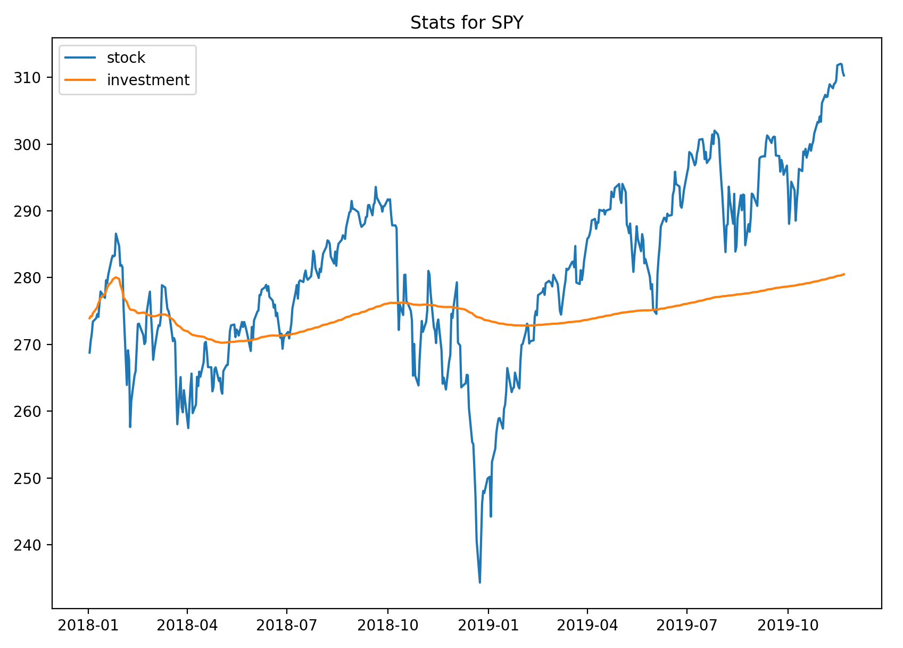

# Trading Algorithms
A backtesting framework for long term trading strategies

---
## Running Code
`python backtest.py <symbol> <start_date> <end_date>`

ex. `python backtest.py SPY 2018-01-01 2019-11-30`

The above code will backtest algorithm on the specified security from start date to end date. After simulating the online algorithm, basic statistics will be outputted. Here is an example:



```
| Statistics      |          |
|-----------------+----------|
| Initial Balance | 25000    |
| Current Balance | 22700    |
| Holding Cash    |  2587.65 |
| Net Worth %     |     1.15 |
| Net Worth $     |   287.65 |
| P&L %           |    12.51 |
```

- Holding Cash refers to the total *dollar* amount of your investment based on the prices on the **end_date**.

- Net Worth is calculated with respect to the sum of the current balance and holding cash in comparison to our initial balance.

- Proft & Loss is calculated with respect to the total amount of money we spend on investments and the value of the securities on **end_date**.


## Unit Tests
### Portfolio
`python3 -m unittest tests.portfolio_test`